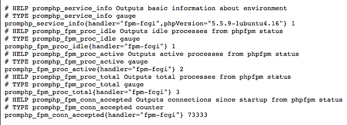

# prometheus-php

PHP5FPM Prometheus Metrics Script

## Getting Started

### Adjusting the Server Configs

In its current state, prometheus-php requires the pm.status page to be available on localhost.  In the examples found inside of this repository, you will find confs to Nginx and Apache that enable the status page of php5-fpm under the directory of: ```127.0.0.1/fpm-metrics/status```.  This does not mean you can't change the ```fpm-metrics/status```, just beware that if you do you will also have to change other files in this repository to match your new location.

**WARNING**: Remember that this status page displays information that might be deemed sensitive to your container/server, therefore please be careful when opening up access to this particular page.

1. Enabling status on php5-fpm - With your favorite text editor, adjust the ```pm.status_path``` to ```pm.status_path = /fpm-metrics/status```

2. Enabling conf on Apache or Nginx

**NGINX**

location: /etc/nginx/conf.d/fpm-metrics.conf

```
# Declaring global fpm-metrics block
location /fpm-metrics/ {
  satisfy any;
  allow 127.0.0.1;
  # Add prometheus server IP here
  # allow 1.1.1.1;
  # Add other host IPs you want to allow here
  deny all;

  location ~ ^(status|ping)$ {
		fastcgi_pass unix:/var/run/php5-fpm.sock;
		include fastcgi_params;
  }
}

# Declaring metrics alias
location /metrics {
	satisfy any;
	# Add prometheus server IP here
	# allow 1.1.1.1;
	deny all;

	alias /path/to/private/metrics.php;
   fastcgi_pass unix:/var/run/php5-fpm.sock;
   include fastcgi_params;
}
```

**APACHE**

location: /etc/apache2/conf-available/fpm-metrics.conf

```
# fpm-metrics/status alias
Alias /fpm-metrics/status "/usr/sbin/php5-fpm"

<Location /fpm-metrics>
	Require ip 127.0.0.1
	Require host your.prometheus.host
	# OR the IP of your prometheus host
	# Require ip 1.1.1.1
	# Add other hosts you want to allow here
</Location>

# Alias to prometheus metrics.  Should be in a private
# folder (not just /var/www) to restrict permissions
Alias /metrics /path/to/private/metrics.php
<Location /path/to/private>
	Require host your.prometheus.host
	# OR the IP of your prometheus host
	# Require ip 1.1.1.1
	# Add other hosts you want to allow here
</Location>
```

Dropping in the Metrics.php
---------------------------

The base metrics.php found in this folder needs to be placed in wherever you are putting your '/path/to/private/metrics.php'.  Once there, and once you are able to swap out the paths in the above configs and enable them, you should be able to view the metrics through Prometheus (as its going to map directly to /metrics).  Inside of the examples/ folder I am also including metrics for particular applications written in PHP in case anyone is wanting to put those in a time series database for whatever reason.

Why a drop-in PHP file?
=======================

When running PHP, you run into two situations: Sometimes users don't have access to the php5-fpm modules, and sometimes users dont have access to anything but dropping a file on the file system.  Though this metrics.php file is meant for users running php5-fpm, you can actually just comment out the FPM statistics portion and gather statistics on whatever you want via PHP and Prometheus.

If you have any questions or comments, please email jbkc85@gmail.com.

EXAMPLES
========

When you visit the site, you will see something similar to this:



SS of prometheus metrics to come...I am at OSCON after all!

TODO
====

[ ] - work on documentation
[ ] - find a way to gather metrics from mod_php without FPM
[ ] - include nginx/apache conf files
[ ] - example/demo page
